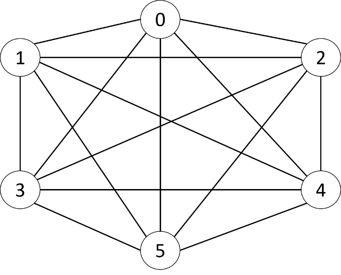

# depth-first-TSP

Implementing depth-first algorythm for Travelling Salesman Problem.
<!-- 
## Índex

1. [Primer apartado](#id1)
2. [Segundo apartado](#id2)
## Primer apartado
Texto del primer apartado
## Segundo apartado
Texto del segundo apartado -->

# Travelling Salesman Problem (TSP)

The problem of the traveling salesman is to travel all the cities of a country, trying to find the lowest cost route, with the caveat that each city must be visited only once. The objective is to find the better route for the traveling salesman.

I resolved this problem using **Depth First Algorythm**. Another algorythms that can be used are:

- Breadth First
- Hill Climbing
- Best First

# Problem modeling

Cities will be named: 0, 1, 2, 3, etc.

The algorithm must search for all possible routes that run through all cities, starting from city “0”, and visiting each city only once. That route that has the lowest possible cost will be the solution.

**State definition**:
    (current city, [cities visited], [route], accumulated cost)

**Initial state**: (0, [empty], [empty], 0)

**Final state**: (N, [1, 2, 3,…, n], [{route}], C)

Where:
- N: Last city visited.
- [1, 2, 3, …, n]: Cities visited (on final state all cities must be visited)
- [{route}]: Cities that were visited in the order that was followed to reach the solution, the solution being the path with the lowest possible cost.
- C: total cost of the route, being the lowest possible cost of all the routes found.

**Rules and restrictions**:
* The traveler must depart in an initial city (by default the city “0” is chosen as the departure city).
* The traveler can move to any city he has NOT visited before.
* The traveler cannot travel from one city to the same city.
* At the time there are no more cities to visit, a partial solution has been reached.
* All partial solutions (routes of all cities) must be searched. The solution of the problem will be the route with the lowest cost.

**Graph example**:

<!--  -->

The following table represents the costs to travel from each city to each other city:

|       |   0   |   1   |   2   |   3   |   4   |   5   |
| ------------- |:-------------:|:-------------:|:-------------:|:-------------:|:-------------:|:-------------:|
|   0   |   0   |  15   |  12   |  60   |  38   |  90   |
|   1   |  15   |   0   |  76   |  19   |  40   |   7   |
|   2   |  12   |  76   |   0   |  81   |  33   |  24   |
|   3   |  60   |  19   |  81   |   0   |  51   |  45   |
|   4   |  38   |  40   |  33   |  51   |   0   |  30   |
|   5   |  90   |   7   |  24   |  45   |  30   |   0   |

The costs of traveling between cities (graph nodes) are represented by a matrix of n x n. In the example matrix it can be observed that:

- Traveling from city 4 to city 2 costs 40.
- The costs of traveling from a city "A" to a city "B" is the same as traveling from city "B" to "A".
- The costs of traveling from a city to itself is irrelevant since it is an action not allowed by the rules, therefore, it is assigned a default cost (in this case 0)

**Goals**:

The goal is to find, of all the possible paths that walk through all cities, the path that has the lowest cost.

As an additional goal, it is desired to know the program execution time for different values of “n” (2, 4, 6, 8,…, until the program runs out of memory to solve the problem.